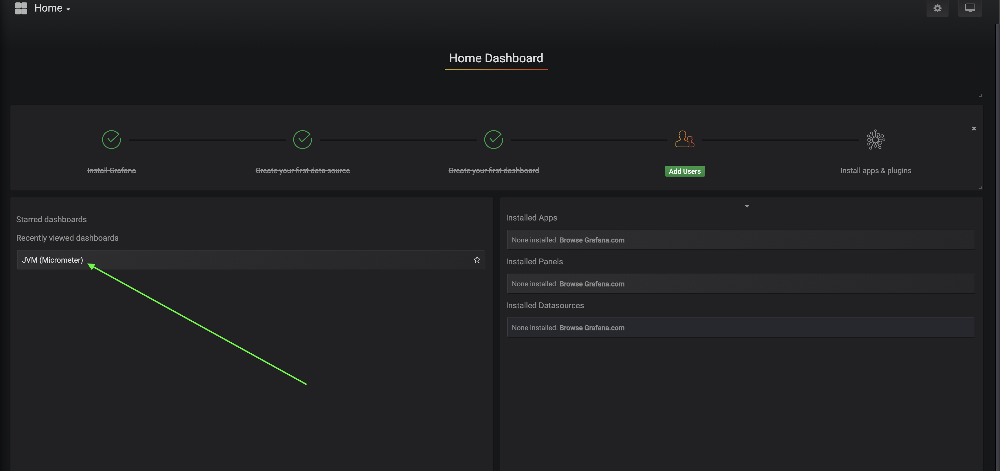
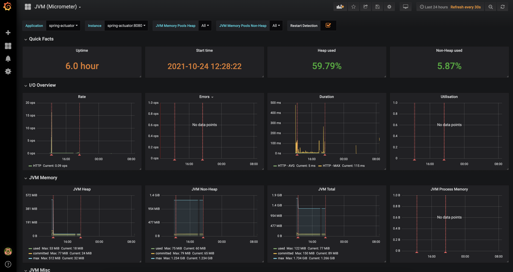

# Spring Actuator Demo

## 1. Requirements

- Unix/Linux OS
- Makefile
- Docker and Docker Compose

## 2. Installation

- `make set-up` - for setting up a docker network
- `make up` - for building & starting spring-actuator-demo, prometheus, grafana apps
- `make down` - for shutdown spring-actuator-demo, prometheus, grafana apps
- `make clean` - for removing the docker network

Ps: Each app also is runnable individually by `make spring-actuator-up` or `make spring-actuator-down`.

## 3. Accessibility & Configuration

- **Spring Actuator Demo** will be available at `http://localhost:8080`
- **Prometheus** will be available at `http://localhost:9090`
- **Grafana** will be available at `http://localhost:3000`

Note: **Spring Actuator Demo** contains one custom endpoint for loading application, there are 2 options:

- for loading CPU (it uses MD5 hashing depending on the rate)
``curl -o /dev/null -s -w 'Total: %{time_total}s\n' http://localhost:8080/?cpu-load-rate=5000``
- for loading Memory (it generates bytes depending on the rate) ``curl http://localhost:8080/?memory-load-rate=5000``

Note: Grafana will require authentication please use `admin` `admin` as username and password for 
signing in.

Choose micrometer Dashboard:

Micrometer JVM Dashboard:

For more details please click [here](./assets/docs/spring-actuator.md).