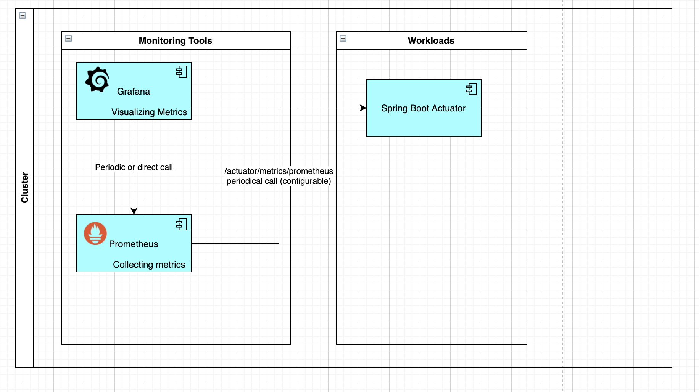
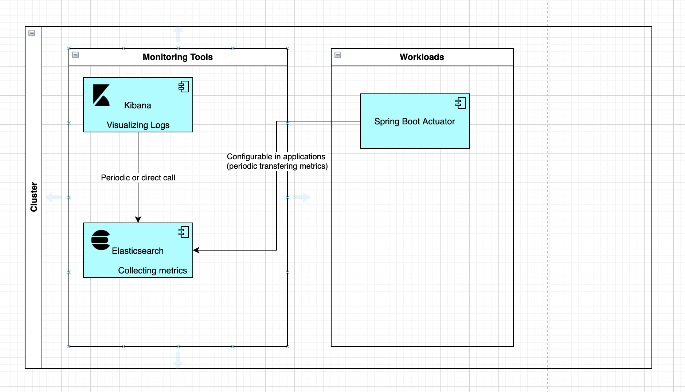
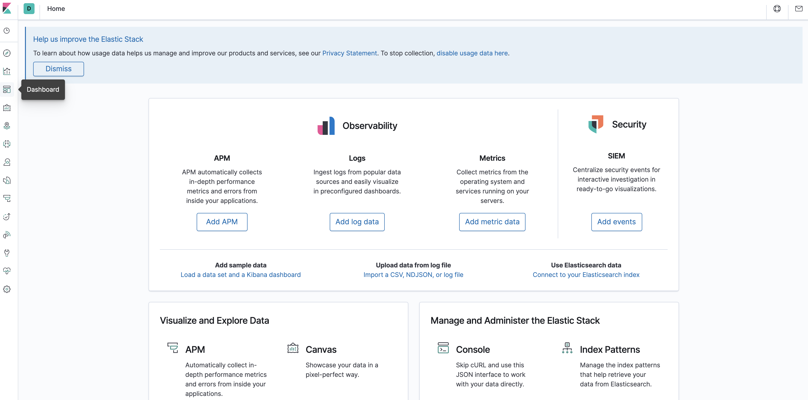
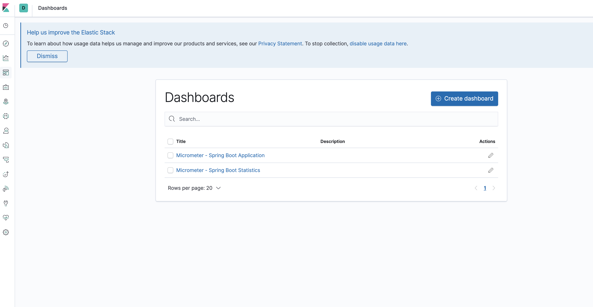
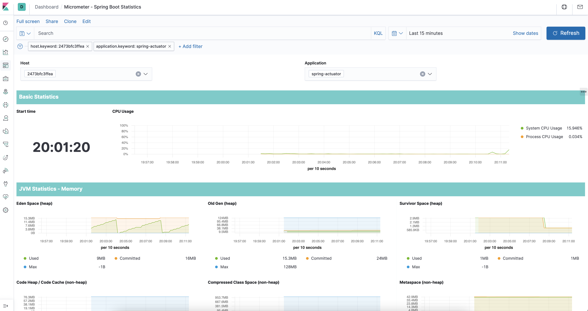

# Spring Actuator Demo

## 1. Requirements

- Unix/Linux OS
- Makefile
- Docker and Docker Compose

## 2. Installation

### 2.1. Set Up

- `make set-up` - for setting up a docker network

### 2.2. Using Prometheus And Grafana Stack

**Prometheus** long polling applications and collects and stores, **grafana** visualise logs from prometheus.

High level diagram:

- `make prometheus-grafana-actuator-up` - for building & starting spring-actuator-demo, prometheus, grafana apps.
- `make prometheus-grafana-actuator-down` - for shutdown spring-actuator-demo, prometheus, grafana apps

### 2.3. Using ELK Stack

**All applications** send metrics to **elastic search's** specific index periodically (configured in app), **elastic search** 
indexing and storing data, **kibana** connecting to **elasticsearch** and visualize metrics.

High level diagram:

- `make elk-actuator-up` - for building & starting spring-actuator-demo, elastic search, kibana apps
- `make elk-actuator-down` - for shutdown spring-actuator-demo, elastic search, kibana apps

### 2.4. Cleaning up

- `make clean` - for removing the docker network

Ps: Each app also is runnable individually by `make spring-actuator-up` or `make spring-actuator-down`, check 
`Makefile`.

## 3. Accessibility & Configuration

### 3.1. Prometheus And Grafana Stack

- **Spring Actuator Demo** will be available at `http://localhost:8080`
- **Prometheus UI** will be available at `http://localhost:9090`
- **Grafana UI** will be available at `http://localhost:3000`

Note: Grafana will require authentication please use `admin` `admin` as username and password for 
signing in.

Choose micrometer Dashboard (click JVM (Micrometer) Dashboard at left bottom corner):

Micrometer JVM Dashboard:

### 3.2. ELK Stack

- **Spring Actuator Demo** will be available at `http://localhost:8080`
- **Elastic search** will be available at `http://localhost:9092`
- **Kibana UI** will be available at `http://localhost:5601`

Kibana Main Page (Choose Dashboards from left menu):

Dashboards (Choose **Micrometer - Spring Boot Statistics** Dashboards):

Spring boot metrics will be shown below:

## 4. Load Testing

**Spring Actuator Demo** contains one custom endpoint for loading application, there are 2 options:

- for loading CPU (it uses MD5 hashing depending on the rate)
  ``curl -o /dev/null -s -w 'Total: %{time_total}s\n' http://localhost:8080/?cpu-load-rate=5000``
- for loading Memory (it generates bytes depending on the rate) ``curl http://localhost:8080/?memory-load-rate=5000``

## 5. Spring Actuator

For more details please click [here](./assets/docs/spring-actuator.md).